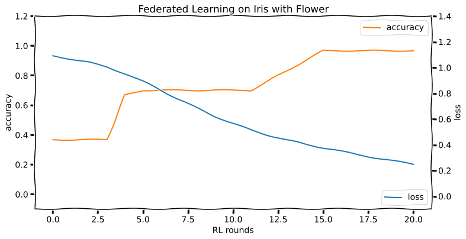

# Federated Learning with Flower

To run this demo online using mybinder, follow the link: [https://mybinder.org/v2/gh/riveSunder/fed_ml_flower_demo/HEAD](https://mybinder.org/v2/gh/riveSunder/fed_ml_flower_demo/HEAD), then take the next three steps to launch a server and two clients in a simulated federated learning run:

1. Open a terminal and type `python -m pt_server -r 40`. You should see some info start scrolling.
2. Open another terminal and enter `python -m pt_client -s alice` to start the "alice" split client. 
3. Open yet another terminal for the second client and enter `python -m pt_client -s bob`. This launches the second client with the "bob" training data split. 

If you go back to the server terminal you should see training progress checkpoints printed to the terminal for each round of training. 

Enjoy!

